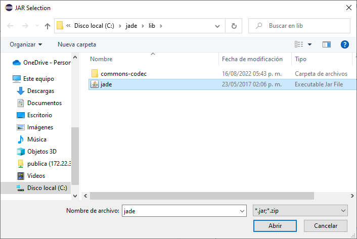
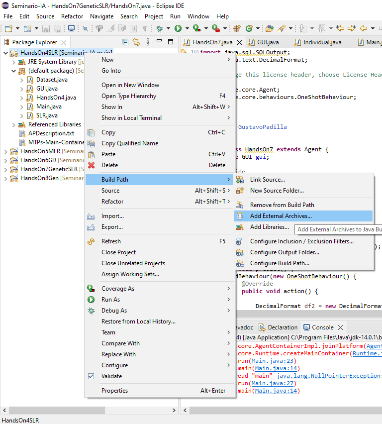
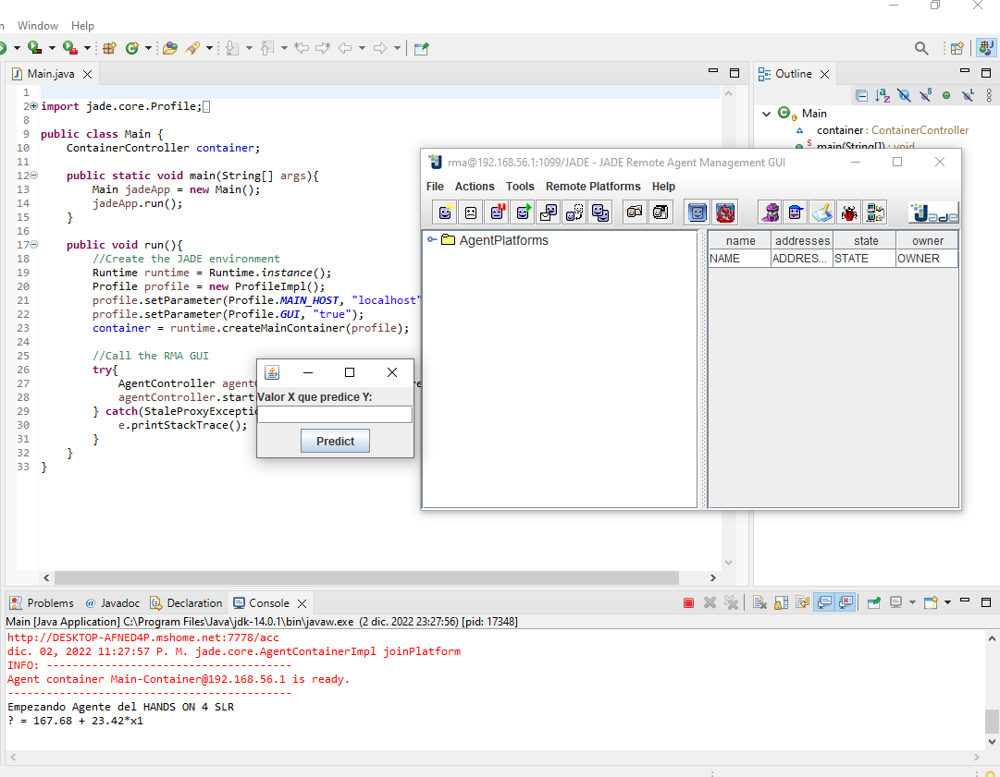

# Seminario-IA
Actividades Seminario Inteligencia Artificial 2022B
- Instalar Jade/Tener el jade.jar

- Tener IDE de java, ECLIPSE RECOMENDADO
- Añadir la libreria al PATH de cada proyecto

- Ejecutar el Main.Java de cada carpeta

